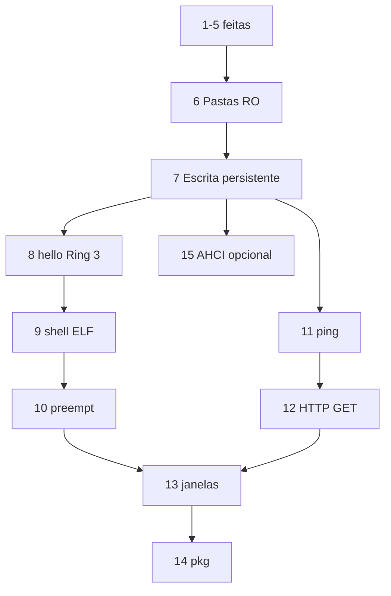

# Quais fases podem correr em paralelo agora

**Resposta curta:** nenhuma. Depois da fase 5 só a **fase 6** está desbloqueada. O spec (apêndice B) só abre ramos **depois da 7**.

Estado actual: 1–5 no kernel ([`kernel/src/blk.rs`](kernel/src/blk.rs), PCI CAM, HAL DMA, `disk`). Não há VFS, FAT, smoltcp, ELF nem AHCI.

## Grafo normativo (apêndice B)

O spec diz explicitamente: fases **11–12 podem avançar em paralelo com 9–10 depois de 7** (rede no prompt in-kernel, sem esperar shell ELF). A fase **15 é opcional e paralela após 7+**.

## Agora (pós-5): só a 6

| Fase | Porquê não agora |
| --- | --- |
| 6 Pastas | Único aceite seguinte: `ls`/`cd`/`cat` numa FAT32 RO em cima do virtio-blk. |
| 7 Escrita | Precisa do VFS/FAT da 6; o aceite é reboot + host a ler o ficheiro. |
| 8 hello | ELF “no disco” implica a imagem FAT da 6; o grafo põe 8 **depois da 7** (persistência sentida antes de userspace). |
| 11 ping | virtio-net é outro dispositivo, mas o spec **não** autoriza 11 em paralelo com 6. Além disso partilha [`virtio_hal.rs`](kernel/src/virtio_hal.rs), [`pci.rs`](kernel/src/pci.rs), idle em [`main.rs`](kernel/src/main.rs) e o GNUmakefile. |
| 13–14 | 13 espera superfície usável (shell + ficheiros); 14 reusa **7 e 8**. |
| 15 AHCI | “paralelo após 7+”: o aceite é `ls` na mesma árvore FAT em SATA, não um probe PCI. |

Dois agentes na 6 e na 11 ao mesmo tempo colidem no HAL/PCI/idle mesmo que o aceite de ping não precise de FAT. Não vale a pena.

Dentro da 6 também não há ramos independentes: VFS mínimo → mount FAT no blk → comandos do prompt. Um único plano, em sequência.

## Primeiro fork (depois da 7)

Três linhas que o spec trata como independentes:

1. **Userspace:** 8 → 9 → 10 (syscall, `libcoeleo`, preempção Ring 3).
2. **Rede in-kernel:** 11 → 12 (virtio-net + smoltcp; `ping`/`get` no prompt). Pode ir **em paralelo com 9–10**.
3. **Hardware real:** 15 (AHCI), se houver PC; não bloqueia 8–14.

**13** junta as duas linhas (compositor + rato; smoltcp e GUI podem ficar no kernel). **14** no grafo vem depois da 13, mas a stack (“reusa 7 e 8”) não precisa de GUI nem de rede — só não a adiantar à custa da 8.

## O que fazer a seguir

Um plano só da **fase 6** (VFS + fatfs + imagem `mkfs.vfat` + `ls`/`cd`/`cat` + `test-phase6`). Sem virtio-net, sem ELF, sem AHCI, sem alterar o spec.
