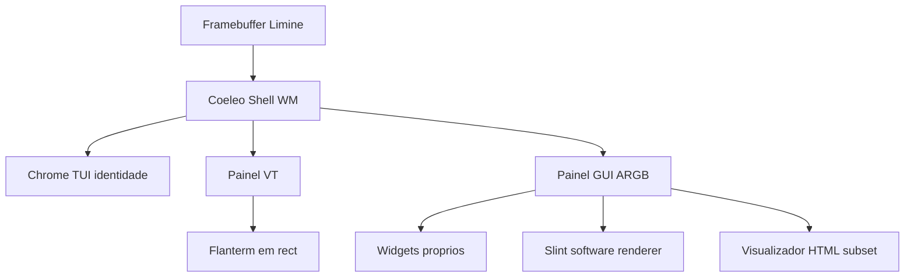

# Ambiente Coeleo: TUI estilo TUIOS + superfícies GUI

## Conclusão da pesquisa

**Viável depois de 1–15**, se o Coeleo copiar o *modelo de interação* do TUIOS e **não** o TUIOS em si. **Não viável** como “correr Chrome, VS Code ou o binário TUIOS”.

O spec já aponta nesta direção: interface híbrida TUI/GUI, compositor software com dirty rects na [fase 13](docs/requirements/coeleo-os-specification-v02.md), Slint só no apêndice A, sem X11/Wayland/Ultralight/Servo. Este trabalho **não entra no caminho 1–15**; a fase 13 continua a ser duas regiões + rato. A visão vive ao lado de [docs/roadmap-pos-fase-15.md](docs/roadmap-pos-fase-15.md) (parede 3).

---

## O que o TUIOS realmente é

[TUIOS](https://github.com/Gaurav-Gosain/tuios) ([docs](https://tuios.gaurav.zip/docs), [artigo](https://terminalroot.com.br/2026/07/tuios-um-gerenciador-de-janelas-para-o-terminal.html)) é um **multiplexador dentro de um terminal hospedeiro** (Linux/macOS), em Go, Charm (Bubble Tea + Lipgloss), PTY, emulador VT próprio.

O que vale roubar para o Coeleo:

- modos **WM** vs **terminal** (Esc / `i`);
- tiling **BSP** (splits, zoom, bordas partilhadas);
- paleta de comandos, workspaces, launcher;
- redraw só quando o estado muda (igual aos dirty rects da fase 13).

O que **não** se porta:

- Charm, PTY POSIX, SSH, cliente web, 342 temas, Kitty/Sixel *passthrough para o terminal do host*. No Coeleo o “host” **és tu**: o framebuffer Limine. Gráficos são superfícies ARGB no compositor, não um protocolo de terminal alheio.

---

## Três arquitecturas (e a recomendada)

**A — Grelha de células (TUIOS no FB).** Tudo é carácter. “GUI” seria Sixel/Kitty desenhado em células. Identidade fácil; editores tipo Helix cabem; rato e browsers pixel-perfect não. **Não cobre o pedido de GUI.**

**B — Compositor de pixels + chrome TUIOS (recomendado).** Evolução da fase 13. O WM faz BSP em rectângulos de pixels. Cada painel é VT (processo + pipes → emulador) **ou** buffer ARGB (`win_create` / `win_damage` do spec). Chrome (bordas, barra, paleta) desenhado à Coeleo, não Charm. Igual em espírito a [Yutani/ToaruOS](http://www.toaruos.org/yutani-the-new-compositor.html) e [Redox Orbital](https://doc.redox-os.org/book/graphics-windowing.html), com *look* de tiling modal em vez de desktop 2009.

**C — Wayland/X ou Orbital+winit.** Redox só corre Slint/Iced porque tem POSIX, winit e um display server. O spec rejeita X11/Wayland e ABI Linux. **Fora.**

---

## Viabilidade por tipo de programa

- **Shell, `ls`, `htop`-like, editor TUI (kilo/nano/Helix-like):** viável. Painel VT + fases 9–10. Primeiro “editor de código” deve ser este, não um IDE.
- **Gestor de ficheiros / settings / paleta:** viável na fase 13 (já pede um painel) e depois como chrome do WM.
- **App GUI nativa (Slint `renderer-software`):** viável **depois** de mmap + protocolo de superfície em userspace. Slint já renderiza para framebuffer/`no_std` ([docs MCU](https://docs.rs/slint/latest/slint/docs/mcu/index.html)). Softbuffer/`winit` **não** servem (são do SO hospedeiro) — a [auditoria v0.1](docs/requirements/old/coeleo-os-validation-v01.md) já o disse.
- **“Navegador”:** Chromium/Firefox/Servo/Ultralight **não** (spec §2 + envelope 512 MiB / 1 núcleo / sem GPU). Viável: visualizador HTML subset (apêndice A) numa superfície GUI. HTTP texto da fase 12 continua o primeiro passo.
- **VS Code / Electron:** não. É um Chromium.

Memória: um framebuffer 1080p 32 bpp ≈ 8 MiB; N janelas fullscreen rebentam PCs fracos. Tiling + dirty rects são o que torna o envelope do spec honesto (a validação v0.1 já avisava o custo de full-frame).

---

## Pré-requisitos (não são o WM)

Ordem alinhada ao spec e ao roadmap pós-15:

1. Fases **10 + 12 + 13** — processos, um segundo sítio no ecrã, rato, dirty rects.
2. **Pipes / stdout por painel** — senão cada VT não é um processo.
3. **mmap + IPC** — senão GUI em Ring 3 copia buffers demais (apêndice A).
4. Fontes (PSF no chrome TUI; TTF só se a GUI o exigir).
5. Slint / HTML viewer — **depois** do WM com 2–3 painéis já ser o sítio onde se trabalha.

USB, ACPI, NVMe **não** bloqueiam o WM no QEMU; bloqueiam o mesmo ambiente num PC moderno.

---

## Identidade visual

Não herdar Lipgloss nem um desktop Aero. Proposta para o documento (não código agora):

- chrome **monoespaçado**, bordas partilhadas, barra de estado (workspace, modo WM/term, relógio da fase 4);
- paleta `Ctrl+P` como launcher do SO;
- zero transparência/alpha (fase 13 já exclui);
- paleta de cores Coeleo pequena e estável (não 342 temas).

---

## Entregável após aprovares este plano

Criar **[docs/ui-coeleo-shell.md](docs/ui-coeleo-shell.md)** (visão, não spec), no tom de [docs/roadmap-pos-fase-15.md](docs/roadmap-pos-fase-15.md):

- o que o TUIOS é vs o que o Coeleo deve ser;
- arquitectura B, tipos de painel, o que fica de fora;
- fases pós-13 com aceite visível (BSP no compositor da 13 → paleta/workspaces → VT por processo → superfície GUI → Slint → HTML subset);
- ponteiro a partir do apêndice A / roadmap-pos-fase-15 (parede 3), **sem** mudar fases 1–15.

Nada de Charm, Go, TUIOS como dependência, nem alteração à fase 13 normativa.
