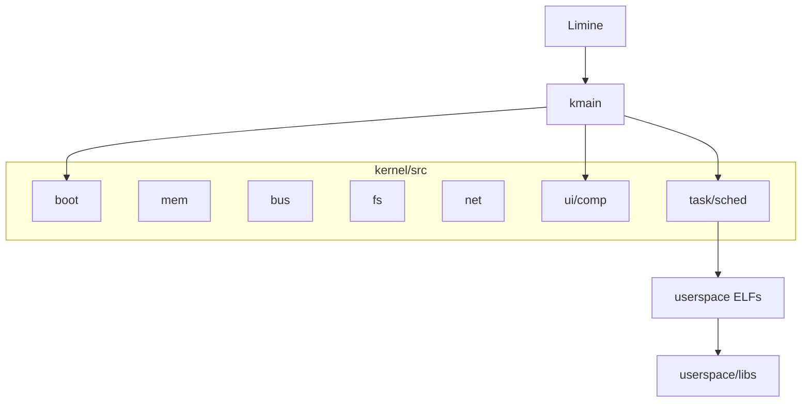

# Architecture

Map of the current code. Behaviour and phases: [spec v0.2](../requirements/coeleo-os-specification-v02.md). Where to put new code and the `crate::comp` / `crate::sched` contract: [`AGENTS.md`](../../AGENTS.md). After 1–15 (reference class **R15**): [roadmap](../roadmap-pos-fase-15.md). Index **16–49**: [implementation-plan-full.md](../requirements/implementation-plan-full.md). In-tree through **21** (16 ACPI/RTC, 17.1–17.4 installer + xHCI/USB MSC, 18 e1000e, 19 DHCP/DNS, 20 argv/pipes, 20b `sh` history/Tab, daily `mkdir`/`echo`/`pwd`, 21 TUI `edit`; USB HID on that xHCI host). Next: [phase 22 TLS + pkg HTTP](../requirements/demands/phase-22-tls-pkg-http.md).

## Boot

Limine loads the kernel (ISO or HDD). Limine requests in [`kernel/src/main.rs`](../../kernel/src/main.rs): framebuffer, HHDM, memory map, executable address, RSDP. `kmain` initializes serial, framebuffer (Flanterm), memory, ACPI (silent), interrupts, block devices, network, FAT, PS/2, UHCI, xHCI HID, compositor, and the `init` process (ELF `sh` if it exists on the FAT; otherwise the in-kernel shell).

## Kernel: one crate, folders by domain

The kernel is **one** crate. Folders are modules, not new crates. `main.rs` reexports the names the rest of the crate already uses (`crate::comp`, `crate::sched`, `crate::fs`, `crate::panel`, …). Do not mass-rewrite `crate::foo` to `crate::ui::foo`.

| Domain | Folder | Role |
| --- | --- | --- |
| Boot / CPU | `kernel/src/boot/` | GDT, IDT, LAPIC, console, serial, kernel shell, `init`, ACPI, RTC |
| Memory | `kernel/src/mem/` | PMM, VMM, heap |
| PCI / USB host | `kernel/src/bus/` | PCI config space, xHCI |
| Disk / FAT | `kernel/src/fs/` | FAT (`fs/mod.rs`), AHCI, block, GPT, USB MSC, install |
| Network | `kernel/src/net/` | smoltcp (`net/mod.rs`), HTTP, DHCP, DNS A, virtio-net **or** e1000e (one PHY) |
| Input | `kernel/src/input/` | keyboard, mouse, PS/2, UHCI, xHCI HID |
| Desktop | `kernel/src/ui/` | compositor (`ui/comp/`), panel, KRunner, FM (`ui/fm/`), VT, windows |
| Processes | `kernel/src/task/` | scheduler (`task/sched/`), syscalls, FDs, pipes, ELF |

`kernel/vendor/` is not reorganized.

**Compositor** (`kernel/src/ui/comp/`): public API in `mod.rs` (`init`, `poll`, `irq_*`, `on_client_*`, …). Paint (shadow, deco, blit) is separate from policy (focus, z-order, launcher). Dirty-rect, not full-frame. The VT (Flanterm) is one window; the file manager is another. Tab and arrows on the VT reach stdin; Tab still cycles windows when Files or an overlay has focus.

**Scheduler** (`kernel/src/task/sched/`): `mod.rs` is the facade. `unsafe`, `naked_asm`, and the `KSTACKS` / `KCONTS` / `FXSAVES` statics stay in `switch.rs`. Do not scatter the context switch. One thread per process; `MAX_PROC` is 4.

**Syscalls:** table in [`kernel/src/task/syscall.rs`](../../kernel/src/task/syscall.rs) (`SYS_EXIT` = 1 … `SYS_MKDIR` = 26). `SYS_SPAWN` takes a 48-byte `SpawnArgs` (path, NUL-separated argv, stdin/stdout fds to clone); `SYS_PIPE` returns two fds; `SYS_MKDIR` creates a FAT directory. `SYS_DISKS` / `SYS_INSTALL` are the installer. `sh` wires `|` `>` `<` at spawn (no `fork`/`dup2`). ELFs call through [libcoeleo](libs/libcoeleo.md).

The kernel depends on crates in `userspace/libs/`: `coeleo-theme`, `coeleo-draw`, `coeleo-image` (path in [`kernel/Cargo.toml`](../../kernel/Cargo.toml)).

## Userspace

Workspace: [`userspace/Cargo.toml`](../../userspace/Cargo.toml). Target `x86_64-unknown-none`, `no_std`, `panic = "abort"`.

- **Libs** — `userspace/libs/`. Sheets in [`libs/`](libs/libcoeleo.md).
- **Apps** — `userspace/apps/`: `sh`, `ls`, `cat`, `echo`, `edit`, `hello`, `fault`, `clock`, `spin`, `winprobe`, `widgets`, `install`. Each is an ELF; `_start` instead of `main`.
- **Host** — `tools/` is not in the image. Packer: [tools-coe-pack.md](tools-coe-pack.md).

Ring 3 GUI chain: `widgets` / `install` → `libcoeleoui` → `coeleo-draw` + `coeleo-theme` + `libcoeleo` (`win_create` / `win_damage` / `poll_input`). The kernel compositor paints chrome (panel, shadow, deco) with the same theme/draw. The client paints an **opaque** buffer.

`sh` is split into `cwd` / `fs` / `net` / `pkg` / `path` / `exec` / `line` / `complete` under `userspace/apps/sh/src/`. History is a 16-line ring (not persisted); Tab completes unique non-directory names from `/bin` and the cwd. The line editor moves with Left/Right; `pwd` / `echo` / `clear` / `mkdir` / `cp` / `mv` are builtins (`echo` with `|` `>` is the ELF). It does not need its own sheet in this directory.

## Disk

Seeds in `disk-seed/` (`README.TXT`, `docs/HELLO.TXT`). The makefile creates:

- **`disk.img`** — 64 MiB, FAT32 on the whole image, label `COELEO`. virtio-blk.
- **`disk-ahci.img`** — 64 MiB, GPT, one type-0700 partition from LBA 2048 (1 MiB). FAT32 **on that** partition. SATA/AHCI.

Directories on the FAT: `docs/`, `bin/` (`pkg install` destination), `pacotes/` (test `.coe`). ELFs at the root (`sh`, `hello`, …) for phase 10 spawn (`hello` is still found as `/hello`). `install` copies a live FAT onto a spare disk (GPT + FAT32 ESP); USB MSC is a `BlockDev` row on the same table.

## Network

One PHY: virtio-net if present, otherwise e1000e. QEMU user-net: DHCP in the kernel (smoltcp); if the lease fails, static **10.0.2.15/24** and gateway **10.0.2.2**. `get`/`ping` accept an IPv4 literal or a hostname with a dot (DNS A). `ping 10.0.2.2` is the phase 11 acceptance; ICMP to the Internet on user-net is not. `make run` keeps virtio-net; e1000e is `make test-phase18` / `make test-phase19` / `make run-e1000e`. No TLS.
